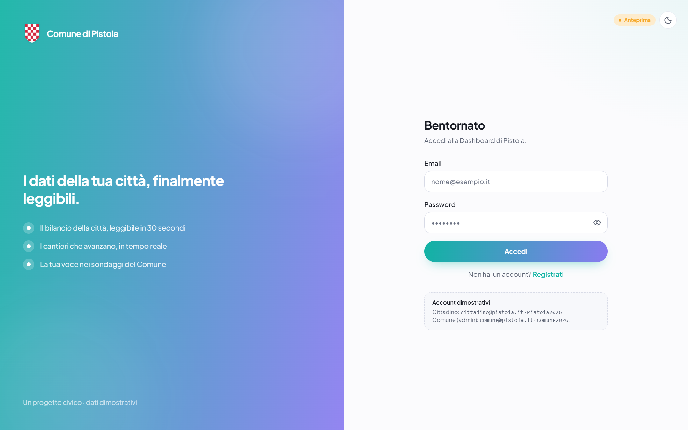
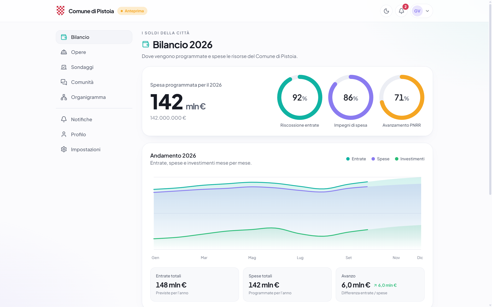
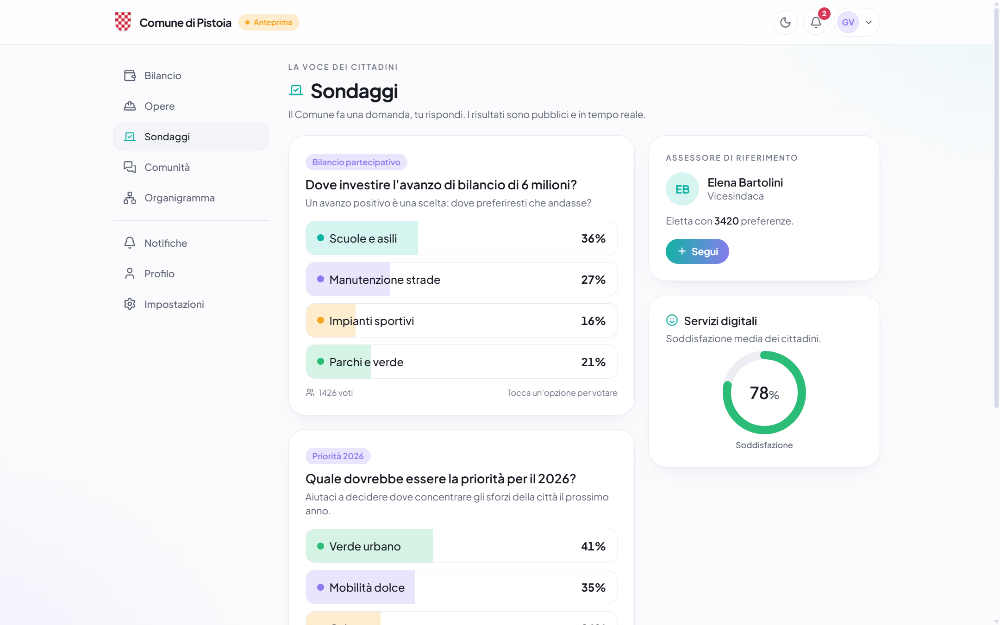
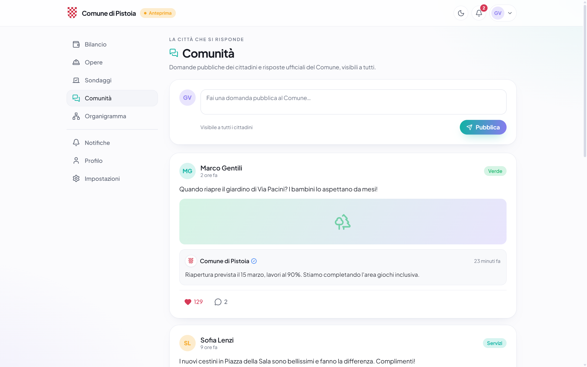
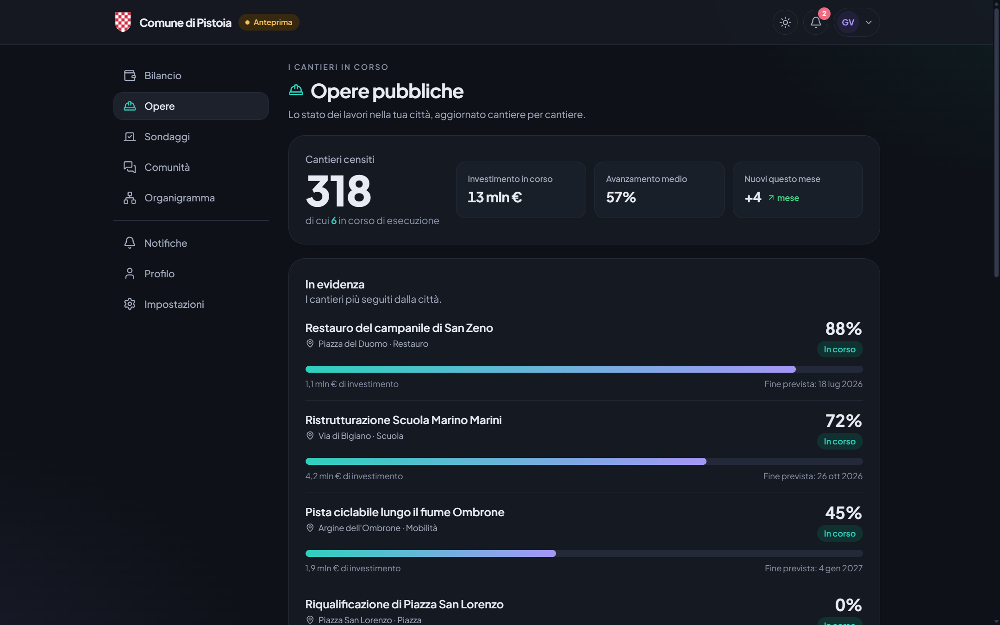

# Pistoia.app

> I dati pubblici di Pistoia, finalmente leggibili.

Piattaforma civica **indipendente** che trasforma **gli atti del Comune, il bilancio, i cantieri,
i sondaggi e le segnalazioni** in un'unica app moderna, chiara e veloce — pensata per i cittadini,
non per i ragionieri.

> ⚠️ **Non è un servizio del Comune di Pistoia.** Parla *di* Pistoia usando dati pubblici, non
> *per* l'amministrazione: la direzione completa è in
> [`docs/direzione-prodotto.md`](docs/direzione-prodotto.md).
>
> ⚠️ **Progetto dimostrativo:** una parte dei dati è di esempio (mock) e dichiarata come tale.
> Gli atti sono invece reali — 26.644, letti dall'albo pretorio. L'autenticazione è reale e sicura.

---

## 📸 Anteprima

| Accesso | Bilancio |
|---|---|
|  |  |

| Sondaggi | Comunità |
|---|---|
|  |  |

**Tema scuro** — i colori di Pistoia restano, l'interfaccia cambia pelle.



---

## ✨ Funzionalità

- **Bilancio** — i 142 mln della città in un colpo d'occhio: anelli di riscossione/impegni/PNRR,
  andamento mensile, spesa per missione.
- **Opere** — cantieri con percentuale di avanzamento in tempo reale e indicatori aggregati.
- **Sondaggi** — il Comune chiede, i cittadini votano (in tempo reale, con UI ottimistica).
- **Comunità** — feed "la città risponde": domande pubbliche e risposte ufficiali verificate.
- **Extra** — organigramma della giunta, centro notifiche, profilo, impostazioni, **area admin**.
- **Login sicuro** — Argon2id, sessioni server-side, rate-limiting, validazione.
- **Tema chiaro/scuro**, design responsive con i colori di Pistoia, animazioni morbide.

## 🚀 Avvio rapido (Windows)

Doppio click su **`start.bat`**: installa le dipendenze, prepara il database con i dati di esempio e
avvia l'app su <http://localhost:3000>. Per fermarla: **`stop.bat`**.

### Avvio manuale (qualsiasi sistema)

```bash
cd pistoia-dashboard
corepack pnpm install --frozen-lockfile
corepack pnpm setup     # crea il DB + migrazioni + dati mockup
corepack pnpm dev       # http://localhost:3000
```

> **Il gestore è pnpm**, e la sua versione la fissa `packageManager` in
> `package.json`: non si installa a parte, lo procura **corepack**, che arriva
> dentro Node. Si scrive `corepack pnpm …` e non `pnpm …` perché `corepack
> enable` — la riga che metterebbe `pnpm` nel PATH — su Windows vuole i permessi
> di amministratore. Chi l'ha già eseguito può omettere il prefisso.

**Account dimostrativi**

| Ruolo | Email | Password |
|---|---|---|
| Cittadino | `cittadino@pistoia.it` | `Pistoia2026` |
| Comune (admin) | `comune@pistoia.it` | `Comune2026!` |

## 🧱 Stack

**Next.js 16** (App Router) · **React 19** · **TypeScript** · **Tailwind CSS v4** ·
**Prisma 7** + **SQLite** · **Motion** · **next-themes** · **Zod**

## 📚 Documentazione

Architettura, modello dati, modello di sicurezza e changelog: vedi **[DOCUMENTATION.md](DOCUMENTATION.md)**.
Vision e concept originale: **[pistoia-dashboard-concept.txt](pistoia-dashboard-concept.txt)**.

---

Progetto di **Lorenzo Cianferoni**.
